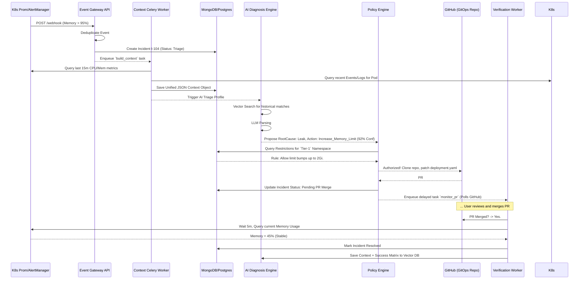

# AutoFixOps: Comprehensive Technical & Systems Architecture Document

**Version:** 1.0 (Draft Architecture)
**Project Title:** AutoFixOps: An Evidence-Grounded, Policy-Safe Self-Healing Framework for Kubernetes
**Target Platform:** Kubernetes (K8s 1.25+)
**Primary Authors:** Vanshit Ahuja, Ojasveer Singh Saini, Astitva Saxena, Vaibhav Jain

---

## 1. Executive Summary & Problem Scope

Cloud-native systems present operational domains bounded by high complexity, heterogeneous telemetry, and rapid state changes. Existing solutions heavily emphasize observability—visualizing failures for human operators. Even current AIOps approaches generally stop at anomaly detection or root-cause localization without acting on the system.

**AutoFixOps** transitions from *reactive observability* to *verifiable autonomy*. The core directive of this architecture is to instantiate a self-healing operational loop that is:
1. **Evidence-Grounded:** Remediation is derived strictly from gathered historical and real-time telemetry context, not isolated system alarms.
2. **Policy-Safe:** No algorithmic inference overrides explicit human-defined policy guardrails (e.g., maximum restarts, production isolation).
3. **Verification-Aware:** An incident is *not* resolved when an action is dispatched; it is only resolved when subsequent telemetry proves system recovery.

---

## 2. Definitive Technology Stack & Toolchain

The following stack establishes the infrastructure required to build, deploy, and scale AutoFixOps into an enterprise-ready prototype.

### 2.1 Infrastructure & Observability
*   **Container Orchestration:** Standard Kubernetes (Minikube/K3s for development, EKS/GKE for production).
*   **Base Telemetry (Metrics):** **Prometheus** (pull-based metric scraping) and **Alertmanager** (event routing).
*   **Base Telemetry (Logs):** **Grafana Loki** (token-efficient log aggregation).
*   **Base Telemetry (Traces):** **OpenTelemetry (OTel)** tracing collectors.

### 2.2 Core Application & Control Plane
*   **Backend Application Framework:** **Python 3.11+**. Chosen for natively vast ML ecosystem support.
*   **API Gateway & Web Interfaces:** **FastAPI**. Chosen for asynchronous capabilities and rapid OpenAPI schema generation.
*   **Asynchronous Task Queue:** **Celery** working in tandem with **Redis** as the message broker. Necessary because gathering large log windows and polling K8s deployments require durable, async workers.
*   **Remediation & GitOps Layer:** **PyGithub / GitPython** (for dispatching Pull Requests) and the **Kubernetes Official Python Client** (for read-only operations and event gathering).

### 2.3 AI, Reasoning, and Data Persistence
*   **Relational Database:** **PostgreSQL** (Managed via SQLAlchemy ORM). Stores rigid, structural data: policies, incident states, RBAC, execution audits.
*   **Document Database:** **MongoDB**. Stores large, schemaless "Incident Context Objects" consisting of massive log snippets and raw trace arrays.
*   **Vector Database (Memory Layer):** **Qdrant** or **Milvus**. Stores embeddings of past incidents (Context + Successful Resolution) to enable Retrieval-Augmented Generation (RAG).
*   **AI Engine Pipeline:** **LangChain**. Used to orchestrate LLM calls, RAG retrieval, and output parsing.
*   **Large Language Model (LLM):** Hybrid strategy. **OpenAI GPT-4o-mini** (for remote intelligence) or **Llama 3 8B** (hosted via local Ollama for zero-egress environments).

---

## 3. High-Level System Architecture and Component Boundaries

AutoFixOps operates as a cohesive, closed-loop sub-system running as a sidecar cluster or isolated namespace within the monitored Kubernetes environment. 

### System Component Diagram

```mermaid
graph TD
    %% Base Infrastructure
    subgraph Target Kubernetes Environment
        app[Microservices] --> |Logs| L[Grafana Loki]
        app --> |Metrics| P[Prometheus]
        P -.-> |Alerts| AM[Alert Manager]
        K[K8s API Server]
    end

    %% AutoFixOps Boundary
    subgraph AutoFixOps Platform
        AM --> |Webhook POST| GW[FastAPI Event Gateway]
        GW --> |Event Payload| MQ[Redis Queue]
        
        %% Worker Layer
        MQ -.-> ICB[Incident Context Builder Worker]
        ICB --> |Fetch Logs| L
        ICB --> |Fetch Metrics| P
        ICB --> |Fetch Events| K
        ICB --> |Save JSON Context| Mongo[(MongoDB Contexts)]
        
        %% Intelligence
        ICB -.-> |Trigger| DIAG[AI Diagnosis Engine]
        DIAG <--> |Query Memory| VDB[(Qdrant Vector DB)]
        DIAG --> |Structured Action| POL[Policy Decision Engine]
        
        %% Safety & Execution
        POL <--> |Check Rules| PG[(PostgreSQL Policies)]
        POL --> |Reject| ESC[Human Escalation/Slack]
        POL --> |Approve| REM[GitOps Remediation Engine]
        
        REM --> |Generate Fix & PR| GIT[User GitHub Repository]
        GIT -.-> |User Merges PR| CD[ArgoCD / GitOps Sync]
        CD --> |Apply Manifests| K
        
        %% Verification
        REM -.-> |Schedule Merge Check| VER[Verification Worker]
        VER --> |Poll Status| GIT
        VER --> |Analyze Recovery| P
        VER --> |Mark Resolved| PG
        VER --> |Learn| VDB
    end

    classDef external fill:#f9f9f9,stroke:#333,stroke-width:2px;
    classDef internal fill:#eaf4fc,stroke:#0071BC,stroke-width:2px;
    class Target Kubernetes Environment external
    class AutoFixOps Platform internal
```

### Component Breakdown
1. **Event Gateway:** A high-throughput API layer ensuring burst alerts from Prometheus do not crash the system. Validates payload, drops duplicates, assigns `Incident_ID`.
2. **Context Builder Worker:** Acts identically to a human SRE opening multiple dashboards. It fetches CPU spikes, error logs, and recent pod crash events that match the alert timestamp and namespace.
3. **AI Diagnosis Engine:** Consumes the context payload. It matches symptoms against known failure taxonomies.
4. **Policy Decision Engine:** The deterministic circuit breaker. Evaluates the AI's intent against enterprise rules. 
5. **GitOps Remediation Engine:** Instead of blindly executing commands against the live cluster, the engine clones the user's infrastructure repository, patches the affected manifest (e.g., bumping memory limits), and opens a Pull Request for human review.
6. **Verification Node:** A deferred celery task awakens to monitor the PR status. Once merged, it waits for the CI/CD deployment context to settle, recalculates error rates and system strain. If normal, it writes the scenario to the AI's Vector DB as a "known fix" (Experience Loop).

---

## 4. Workflows and System Diagnostics 

To illustrate how data translates to autonomous motion, let's observe the core `AutoRepair` Sequence using the GitOps integration approach. 

### Incident Resolution Sequence Diagram



---

## 5. Detailed AI Engine Design

The AI system inside AutoFixOps is not an unconstrained chat agent. It is a strictly bounded, structured reasoning engine built on LangChain.

### 5.1 The Taxonomy & Structure
The AI is prompted to return outputs conforming strictly to Pydantic objects. The output schema is defined as:
```json
{
  "incident_classification": "OOM_KILLED_LOOP",
  "confidence_score": 0.88,
  "reasoning_summary": "Loki logs indicate Java heap space exhaustion. Metrics confirm rapid memory spike overriding limits.",
  "recommended_remediation": {
    "action": "SCALE_VERTICAL",
    "sub_action": "INCREASE_MEMORY_LIMIT",
    "target_resource": "deployment/payment-service"
  }
}
```

### 5.2 Retrieval-Augmented Generation (RAG) Setup
When the Event Context is built, the AI Engine converts the symptoms into Vector Embeddings using `sentence-transformers/all-MiniLM-L6-v2`. It queries Qdrant to find historical incidents in the company's cluster that looked identical. 
* If a past incident was resolved by increasing memory limits, that contextual knowledge is injected dynamically into the LLM prompt.
* *Result:* The AI creates institutional memory, avoiding the "cold start" problem.

---

## 6. Policy Definitions and Execution Guardrails

The largest risk in LLM automation is non-deterministic actions tearing down production infrastructure.
AutoFixOps implements a strictly deterministic Policy Engine sitting between the AI and the K8s API.

**Policy YAML Schema Example:**
```yaml
policies:
  - id: pol-prod-freeze
    name: Restrict Production Restarts
    namespace_selector: [prod, billing]
    action_type: [RESTART_POD, SCALE_DOWN]
    requires_approval: true
    escalation_channel: slack/#sre-alerts
    
  - id: pol-max-thrash
    name: Anti-Thrashing Loop
    namespace_selector: [*]
    action_type: [RESTART_POD]
    condition: "action_count(type=RESTART_POD, target={{target}}, duration=60m) <= 3"
```
If the AI recommends a `RESTART_POD` on the billing service, the Policy Engine parses `pol-prod-freeze`, realizes `requires_approval: true`, and instead of acting, it sends an interactive Slack message with "Approve / Deny" buttons.

---

## 7. Core Database Schemas

### PostgreSQL (Relational Integrity)
**Table: incidents**
* `id` (UUID, PK)
* `status` (Enum: Ingested, Contextualizing, Diagnosing, Remediating, Verifying, Resolved, Escalated)
* `alert_fingerprint` (String, for deduplication)
* `severity` (String: Critical, Warning)
* `created_at` (Timestamp)
* `resolved_at` (Timestamp)

**Table: remediation_audits**
* `id` (UUID, PK)
* `incident_id` (FK to incidents)
* `proposed_action` (String)
* `policy_id_triggered` (String, nullable)
* `execution_status` (Enum: PR_Created, PR_Merged, PR_Rejected, Succeeded, Failed)
* `github_pr_url` (String, nullable)

### MongoDB (Telemetry Snapshot Store)
**Collection: incident_contexts**
* `incident_id` (UUID)
* `raw_logs`: [ Array of 500 JSON log objects surrounding crash ]
* `metric_arrays`: { "cpu": [0.1, 0.4, 0.9, 1.0], "mem": [...] }
* `k8s_events`: [ Array of cluster state changes ]
*(MongoDB is utilized because this telemetry data varies radically in schema and scale per incident).*

---

## 8. Development Roadmap and Feature Rollout

The project is structured in 5 progressive phases to ensure stability before autonomous execution is introduced.

### Phase 1: Observability Grid & Substrate
- Deploy application target (Microservices e.g., Sock Shop) on Minikube.
- Integrate Loki, Prometheus, and Kube-state-metrics.
- Write Chaos Engineering scripts (CPU Hog, Memory Leaks) to force failures.

### Phase 2: Ingestion & Control Plane Standup
- FastApi implementation with `POST /api/v1/prometheus-webhook`.
- Database initializations (Postgres, MongoDB).
- Develop Celery Workers that successfully parse Webhooks and compile the Mongo Context Object.

### Phase 3: Policy-Driven Rules System (The Baseline)
- *No AI yet.* Build the Remediation Engine and K8s API Controller.
- Write static rules: If Alert == 'CrashLoopBackOff', then restart.
- Build the Verification Worker that checks metrics 5-minutes post-action.
- Evaluate the baseline MTTR (Mean Time to Resolution).

### Phase 4: AI & Memory Layer Introduction
- Introduce Langchain and Qdrant.
- Map the AI Diagnostic taxonomy. Implement structured JSON constraints.
- Connect AI output -> Policy Engine rules.
- Implement the "Success Logging" vectorization loop.

### Phase 5: Complete Verification and Academic Testing
- Perform blind Chaos Engineering injections.
- Generate metrics comparing baseline K8s recovery vs AutoFixOps recovery.
- Prepare defense and presentation metrics mapping MTTR drops.

---

## 9. API Specifications (v1 Core Endpoints)

While primarily asynchronous, AutoFixOps exposes APIs for observability and administration.

1. **`POST /api/v1/alerts`** - Consumes standard Prometheus webhook payloads.
2. **`GET /api/v1/incidents`** - Returns the real-time pipeline status of all active anomalies.
3. **`GET /api/v1/incidents/{incident_id}/context`** - Retrieves the raw JSON telemetry snapshot used by the AI.
4. **`POST /api/v1/escalations/{action_id}/approve`** - Human-in-the-loop endpoint triggered by Slack integrations to override a `requires_approval` policy.
5. **`GET /api/v1/metrics`** - Internal metrics indicating AutoFixOps uptime, successful remediation rate, and MTTR deltas.
